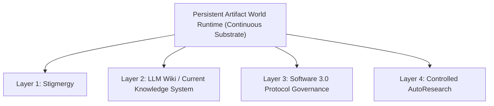

# Nexus Reform Revolution Charter & Foundational Manifesto

> **Status**: RATIFIED DOCTRINE (Repair 0.2.1)  
> **Scope**: Nexus Clean-Room Reform Laboratory Foundational Charter  

---

## 1. Termination of the Legacy Letter-Centric Governance Accretion Phase

The legacy Nexus system entered an accretion trap where every operational concern spawned a new human/agent protocol letter, custom script, or manual dispatch check. This letter-centric governance accretion led to:
- **Protocol Inflation**: Overhead grew faster than systemic output.
- **Accidental Complexity**: Session boundaries, pattern seats, outbox cards, and manual confirmations created fragmented, fragile control flows.
- **Human Bottlenecking**: Human operators were forced into continuous low-level roles as manual couriers, message routers, regex query engines, and state sync checkers.

---

## 2. Core Architectural Reforms: One World + Four Layers ("一世界四层")

The architecture is NOT five parallel components. It consists of **One Persistent Artifact World Runtime** serving as the continuous substrate, within which **Four Orthogonal Layer Mechanisms** operate:

1. **Persistent Artifact World Runtime**:
   - The continuous, file-backed environment surviving independently across ephemeral, identity-free agent instances.
   - Operates on an `observe → act → leave trace → exit → re-entry` lifecycle loop.
   - Enforces strict isolation between agent-visible domain artifacts (`worlds/`) and operator apparatus (`operator/`).

2. **Stigmergy**:
   - Environment-mediated coordination. Ephemeral agents coordinate by discovering, claiming, updating, and completing tasks via persistent state changes in the environment rather than passing transient context messages.

3. **LLM Wiki / Current Knowledge System**:
   - Incremental compilation of raw, append-only history into a structured, hyperlinked multi-page knowledge graph (Entity pages, Topic pages, Current State projections, Indices, Contradiction registers).

4. **Software 3.0 Protocol Governance**:
   - Natural language protocols are treated as versioned, governed software assets (with protocol IDs, versions, scopes, precedence rules, linting, tests, rollout, deprecation, and rollback).
   - **Immutable Boundary**: Software 3.0 does NOT replace deterministic code, databases, transaction boundaries, or security mechanisms; natural language protocols CANNOT override or rewrite security boundaries.

5. **Controlled AutoResearch**:
   - Closed-loop empirical evaluation operating under a fixed workload, explicit baseline, candidate variation, external independent evaluator, raw output logging, and strict `KEEP / REFINE / DISCARD / REVERT` decision criteria, modifying one bounded variable at a time.

---

## 3. Policy & Governance Rules

1. **No Reinventing Wheels (Adapter / Glue / Bridge / Policy Boundaries)**:
   - Existing open-source infrastructure (Beads, git, standard runners, established workflow tools) MUST be evaluated before writing custom engines.
   - The lab primarily builds **adapters**, **projections**, **bridges**, and **policy boundaries**.

2. **Human Operator Role Shift**:
   - Human operators intervene ONLY for genuine strategic decisions, policy choices, or irreversible real-world actions.
   - Routinized dispatch, message passing, indexing, and state checks MUST be automated via clean projections.

3. **Legacy Nexus as Read-Only Research Subject**:
   - Legacy Nexus codebases, archives, and threads serve strictly as read-only fixtures and empirical evidence sources.
   - Legacy letter routing, seats, Boss/Secretary protocols, and RESULT formats are NOT normative.

4. **Controlled Bootstrap & Rollback Guarantees**:
   - Every experimental step requires committed evidence before claiming progress.
   - History is preserved in append-only raw form; failed experiments are logged as historical evidence and rolled back cleanly.

5. **Security & Boundary Enforcement**:
   - Autonomous background daemons, auto-start loops, and self-expanding permission escalations are STRICTLY PROHIBITED.
   - Ephemeral agents operate under explicit, human-authorized execution boundaries.

6. **Dual-Storage Evidence Rules (GitHub + Google Drive)**:
   - **GitHub**: The sole authoritative audit source for text artifacts, code, configs, structured logs, and evaluation manifests.
   - **Google Drive**: Used exclusively for heavy media assets (videos, large archives, raw traces), anchored strictly under the `ChatGPT-Bridge` root folder (`1CdkiOeZNsQ9HAMXXbZHSjMi_oUuRvKf2`) and registered in `external-artifacts/drive-manifest.json`.
