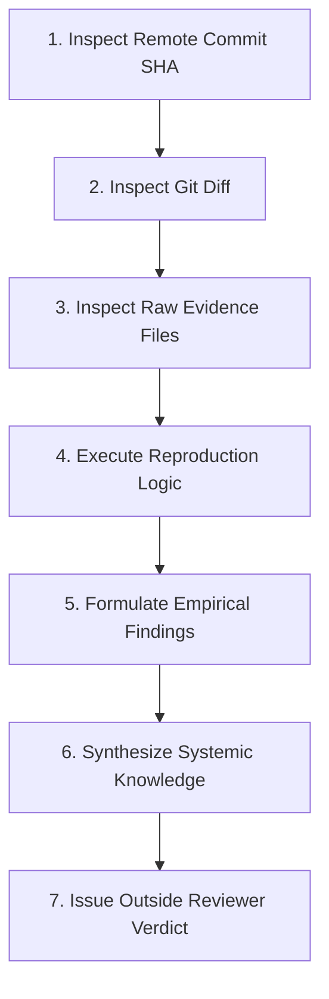

# Remote-First Audit Methodology

> **Status**: RATIFIED AUDIT PROTOCOL  
> **Scope**: Mandatory audit procedures for evaluating clean-room research, code, and experimental evidence.  

---

## 1. The 7-Step Remote Audit Pipeline

1. **Remote Commit SHA**: Verify commit hash on `origin/<branch>` matches local `HEAD`.
2. **Git Diff**: Audit file modifications line-by-line for hardcoding or unauthorized logic.
3. **Raw Evidence Files**: Read raw un-truncated outputs, stdout, stderr, and command logs via GitHub HTTP endpoints (`read_url_content`).
4. **Reproduction Logic**: Re-run verification scripts locally against isolated inputs.
5. **Empirical Findings**: Log verified facts with exact line numbers and SHA-256 hashes.
6. **Knowledge Synthesis**: Update canonical doctrine or knowledge pages.
7. **Outside Reviewer Verdict**: Assign explicit epistemic status (`CONFIRMED`, `PARTIAL`, `INCONCLUSIVE`, `REJECTED`).

---

## 2. Standard Epistemic Ratings

- **`CONFIRMED`**: Claim is fully backed by reproducible, un-truncated raw execution logs and committed code.
- **`PARTIAL`**: Implementation or evidence exists but contains known gaps or unverified assumptions.
- **`INCONCLUSIVE`**: Evidence is incomplete, ambiguous, or requires further refinement.
- **`REJECTED`**: Claim failed verification, contained hardcoded shortcuts, or violated invariants.
- **`CLAIMED-NOT-EVIDENCED`**: Feature or metric is asserted in documentation but lacks raw execution log evidence.

---

## 3. Evidence Integrity Rules

1. **Chat Summaries Are Not Evidence**: Chat messages or natural language summaries serve only as pointers/indices; they are NOT evidence.
2. **Git is the Sole Authoritative Audit Trail**: Only committed repository files and GitHub raw HTTP URLs constitute valid evidence.
3. **Dual-Storage Binding**: Heavy media assets (videos, traces) stored in Google Drive MUST be bound to Git commits via `external-artifacts/drive-manifest.json` with file ID and SHA-256 hash.
