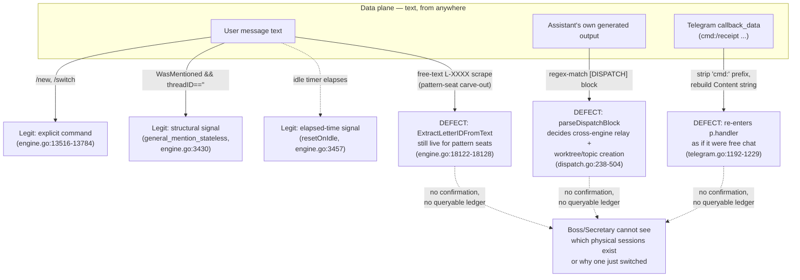
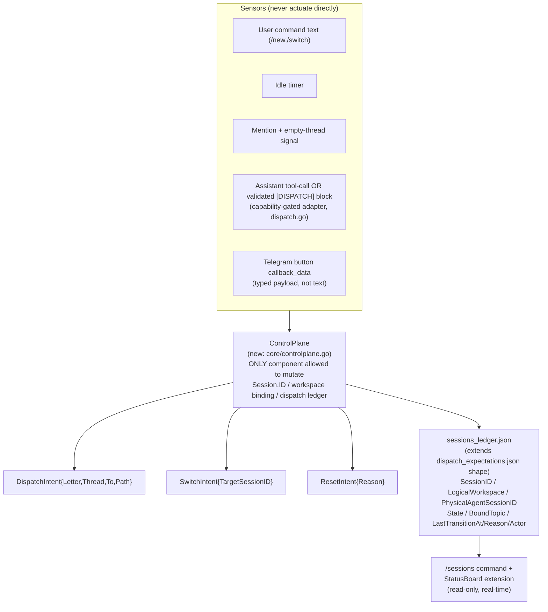

# L-0658 RESULT: cc-connect Session Control-Plane / Dispatch Structural Diagnosis + Decoupling RFC

## Conclusion

Boss's "`[DISPATCH]` text matching is a surface slice" instinct is correct, but the deeper defect is not "text matching exists" in general — **six independent code sites in `cc-connect` each decide session/workspace lifecycle on their own local rule, with no single control-plane authority**, and of those six, exactly **three** let a text-generation or text-resynthesis channel directly actuate a persistent, hard-to-reverse action instead of routing through a typed, validated intent: (1) `[DISPATCH]` block-matching on the assistant's **own free-form output** (`core/dispatch.go:238-283`, `:487-504`), (2) the pattern-seat free-text `L-XXXX` scrape still alive inside `resolveWorkspacePattern` (`core/engine.go:18122-18128`), and (3) the Telegram inline-keyboard callback handler, which — despite being cc-connect's one existing "structured input" mechanism — **collapses back into the same free-text command parser** it was supposed to replace (`platform/telegram/telegram.go:1192-1229`: `command := strings.TrimPrefix(data, "cmd:")` then `p.handler(p, &core.Message{Content: command, ...})`). The other three decision sites — `/new`/`/switch` slash commands, the idle-timeout reset, and the `general_mention_stateless` reset — are already legitimate: they act on an explicit user command or a structural signal (elapsed time, thread-ID-empty + WasMentioned), not on message *content*, and should not be rewritten.

**Root cause, one sentence**: *the message-handling pipeline (whatever text arrives — from the user, from the assistant's own generation, or resynthesized from a button callback) is making persistent session/workspace/dispatch-lifecycle decisions that only one explicit control-plane component, driven by stable keys and visible to Boss before and after each transition, should own* — the same "sensors never actuate / one decider" shape already adopted as a standing invariant for the Resonova Spotify/commentary handoff (L-0629), one layer down, in a different codebase.

This is not a fresh finding invented for this letter — it is the **second occurrence** of an invariant this fleet already wrote down. `docs/protocols/observe-first-stable-identity.md` (ratified 2026-07-23, `docs/retros/2026-07-23-session-drop-two-causes.md`) states the canonical rule verbatim: *"持久身份只能由稳定键派生，绝不由单条消息的可变内容派生"*, born from PR #53/#54 (commits `f05158b9`, `aa74b669`) fixing exactly this class of bug for **session-shard resolution**. What's new in this letter is that the same invariant is violated **again, in three different places that PR #53/#54 didn't touch** — the dispatch-block parser, the pattern-seat scrape fallback, and the button-callback resynthesis — because the fix that landed was a **local patch to `resolveWorkspacePattern`**, not a structural control-plane component the next case would automatically inherit. `git log` shows this function has now absorbed **five** separate "just this one exception" patches across L-0320 (PR #15), L-0330 (PR #19), the L-0587 cooperative-seat carve-out (`e1d8cb38`/`aa74b669`), and yesterday's `fa65aa07`/`d87c663f` ("pin pattern-seat topic to its first-resolved letter") — the same whack-a-mole the retro doc's §3 explicitly warned would recur if the invariant weren't deposited somewhere load-bearing.

## Archive Scan (mandatory, L-0636)

Scanned `INDEX.md` (keyword: dispatch/session/state machine/ledger/inline keyboard/文本匹配) and `threads/`. Hits, all cited above or below: L-0122/L-0125/L-0126 (dispatch ledger design precedent), L-0275 (ledger write-ordering bug), L-0320/L-0330 (`ExtractLetterIDFromText` origin and regex hardening), L-0479 (prior Inbox/Outbox second-opinion RFC — same "durable ledger, not text" shape, different subsystem), L-0537 (task/session-tool vs. archive-letter boundary — orthogonal, cited by Boss's own Context Digest, not reused here), L-0629 (Resonova handoff-authority invariants — structural parallel, see below), git commits `f05158b9`/`aa74b669`/`fa65aa07`/`d87c663f` plus their retro doc. No prior letter proposed the specific `SessionControlPlane` unification below; this is new synthesis, not a duplicate.

## Prior-Art Survey (heavy/design-class mandate)

| Considered | Verdict | Why |
|---|---|---|
| Extend `DispatchExpectation` ledger (`core/dispatch.go:46-73`) into a general session ledger | **Adopt (Phase 1)** | Already the closest existing pattern: a JSON-file-backed, mutex-guarded, atomic-write store keyed by stable fields (Letter/Thread/To), exactly the shape `observe-first-stable-identity.md` prescribes. Extending it, not replacing it, is the smallest diff. |
| `topic_letter_binding.go`'s "pin to first-resolved letter" store | **Adopt as pattern, reject as final shape** | It is itself a workaround bolted onto `resolveWorkspacePattern` rather than a first-class control-plane primitive — correct instinct (stable persisted binding beats live text-scrape), wrong location (should live inside the control plane, not as a side-store the resolver falls back to). |
| Native LLM tool-call / function-call for dispatch instead of `[DISPATCH]` text block | **Adopt, capability-gated (Phase 3)** | Claude Code CLI supports tool use natively; Cursor/Copilot/OpenCode adapters may not uniformly. `core/bridge_capabilities.go` already has a capability-detection precedent for exactly this kind of "does this harness support X" branching — reuse it rather than inventing a new capability flag scheme. |
| Telegram Inline Keyboard buttons for session lifecycle actions | **Adopt, fix the collapse (Phase 5)** | The mechanism already exists (`handleCallbackQuery`) and is already used for the one-click-close-letter flow (L-0449/L-0451). The defect is not "no buttons exist," it's that the button handler re-synthesizes a text `Content: command` string and feeds it back through the exact same parser as free chat — a distinct control channel that doesn't behave like one. Fix the collapse; don't build a second button system. |
| Full event-sourced state machine (e.g., a formal FSM library) for session lifecycle | **Reject for now** | No evidence this system's transition count/complexity (create/resume/rotate/switch/dispatch/close — six states, few edges) justifies a general FSM framework. A single `ControlPlane` struct with typed intent methods and one ledger achieves the same auditability with a fraction of the surface. Revisit only if a future letter shows the six-state model growing materially. |
| Do nothing beyond the already-landed L-0587 fix | **Reject** | Query item 3 (100% real-time session visibility) has no code today — `StatusBoard` (`core/statusboard.go`) renders engine-level `working/idle/assigned/hung`, not physical-session identity/count/binding. And two of the three text-actuation holes (dispatch-block, callback collapse) are untouched by L-0587, which only fixed shard *resolution*, not dispatch *triggering*. |

## RFC: Session Control-Plane / Data-Plane Decoupling

### Current shape (six decision sites, evidence)

### Target shape

### Migration (phased, no big-bang; each phase independently shippable and revertable)

- **Phase 0 (this letter)**: ratify the invariant extension; no code.
- **Phase 1 — visibility only, near-zero risk**: build `sessions_ledger.json` (same atomic-write/mutex shape as `dispatchStore`, `core/dispatch.go:119-236`) fed by existing transition points without changing their behavior; add a `/sessions` command and extend `StatusBoard` (`core/statusboard.go:261-293`) to show per-session identity/state alongside the existing per-engine working/idle/assigned/hung row. **Directly answers Query item 3.** Ships independently of Phases 2-5.
- **Phase 2 — introduce `ControlPlane`, behavior-neutral**: add `ControlPlane.Dispatch(DispatchIntent)`, `.Switch(SwitchIntent)`, `.Reset(ResetIntent)` as the single call sites; `parseDispatchBlock` becomes one *caller* of `ControlPlane.Dispatch`, not the decision-maker. Every transition now writes one ledger row — pure refactor, no user-visible change yet.
- **Phase 3 — kill the dispatch-block text-actuation hole**: for harnesses with native tool-call support (Claude Code, confirmed), replace the assistant emitting a matchable `[DISPATCH]` text block with an actual tool call the harness validates against a JSON schema *before* generation completes, not after via regex. Use `bridge_capabilities.go`'s existing per-harness capability detection to gate this — text-block parsing remains the fallback adapter for harnesses without tool-call support, so nothing regresses for them.
- **Phase 4 — kill the pattern-seat scrape hole**: once every legitimate manual-redirect path (L-0320's original use case) is provably reachable via a typed `SwitchIntent` (button or `/switch`), delete the `ExtractLetterIDFromText(messageHint)` fallback at `engine.go:18127` entirely rather than fencing it further.
- **Phase 5 — kill the callback-collapse hole**: `handleCallbackQuery`'s `cmd:` branch calls `ControlPlane` methods directly with the button's typed payload instead of rebuilding a `Content: command` string and re-entering `p.handler`.

**Acceptance test per phase**: Phase 1 — `/sessions` output matches on-disk shard files 1:1 (script-verifiable, same method as the retro's §2.2 "hash the candidate workspace strings and match them to shard filenames"). Phases 2-5 — for each, a regression test asserting the *old* text-actuation path no longer mutates `Session.ID`/workspace binding when the corresponding typed intent is absent, mirroring the existing pattern in `aa74b669`'s regression test for the shard-hop bug.

**Owning seat**: architect (`F:\GitHub\cc-connect\` is architect's own infra layer per Workspace Map, not a product dev seat's domain) — flagged in Open Points for sequencing, not self-assigned here since Expected Output asked for diagnosis + RFC only.

## Options for Boss

1. **(Recommended) Approve Phase 1 now, Phases 2-5 as a follow-up letter after L-0657 lands.** Phase 1 is pure-additive visibility (directly answers "100% real-time visibility" from the QUERY) with near-zero regression risk and no dependency conflicts. Phases 2-5 touch `core/dispatch.go` and `core/notify.go`, which currently have an **unpushed branch** (`architect/L-0654-ledger-race-fix`) and an **open QUERY** (L-0657, "push branch & create PR") in flight on the same files — starting Phase 2 before that lands risks stacking conflicting changes on the same ledger code. Cost: two letters instead of one; benefit: the highest-value, lowest-risk piece ships immediately and the riskier refactor is properly sequenced.
2. **Approve the full 5-phase migration in one letter, sequenced internally by the assigned engineer.** Same technical content as Option 1, but as a single mandate rather than two. Cost: one long-running engineering task spanning cc-connect's hottest paths (`handleMessage`, `resolveWorkspacePattern`, the callback-query handler) with the L-0654/L-0657 sequencing risk absorbed inside it rather than enforced by a letter boundary.
3. **Scope down to closing only the three concrete text-actuation holes (dispatch-block, pattern-seat scrape, callback-collapse), skip building `sessions_ledger.json`/`/sessions`.** Cheapest option that still kills the root-cause pattern Boss actually flagged, but leaves Query item 3 (session transparency) unanswered — Boss would still have no way to see how many physical sessions exist without asking an engineer to grep logs, same gap that exists today.

## Open Points

- `architect/L-0654-ledger-race-fix` (unpushed, per Rehydration Digest) and the open L-0657 QUERY ("push & create PR") both touch `core/notify.go`/dispatch-adjacent code. Whichever option Boss picks, Phase 2+ work should not start until L-0657 resolves — flagged as a sequencing fact, not a recommendation to reorder Boss's existing queue.
- The Resonova Spotify/commentary handoff invariants from L-0629 (sensors never actuate / one decider / handoff-as-object with phase / owned lifecycle) are structurally identical to what Phase 2's `ControlPlane` proposes here, in a different codebase. Worth Boss knowing this is a recurring fleet-wide shape (product and infra both), in case a generic cross-repo doctrine subsection is ever wanted — noted for Boss/Secretary to decide, not decided here.
- Whether Phase 3's tool-call adapter should extend beyond Claude Code to Cursor/Codex/OpenCode now or stay Claude-only initially depends on Boss's harness roadmap, which is outside this letter's evidence base.
