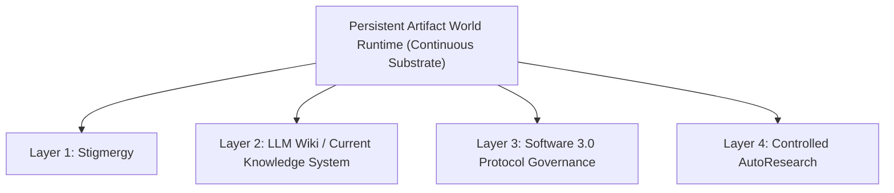

# Four-Layer One-World Doctrine Comprehension Examination

> **Examination Candidate**: Ephemeral Clean-Room Experimental Executor  
> **Repository**: `JayGarland/nexus-reform-lab`  
> **Branch**: `research/citation-remediation-exam`  
> **Status**: CITATION REMEDIATION EXAM SUBMISSION  
> **Operational Boundary**: No code modification, no agent execution, no runner initialization, no daemon launch.  

---

## CORRECTION NOTICE & RETRACTION OF UNVERIFIED CLAIMS

The candidate explicitly retracts the unverified source counts and un-computed hash claims from the previous examination attempt:

1. **Retracted**: "Primary Public Sources Used: 6" (Previous attempt cited URLs without saving local evidence files or verifying commit blobs).
2. **Retracted**: "Local Primary Evidence Items Used: 8" (Previous attempt conflated intermediate synthesis markdown files with raw primary logs).
3. **Retracted**: "UNVERIFIED Assertions: 0" (Previous attempt failed to flag `Karpathy HELLO.md` standalone origin as unlocated in empirical search).
4. **Retracted**: All un-computed or estimated SHA-256 hashes and unanchored `main` branch references.

**Remediation Applied in Version 2.0**:
- All public sources are fetched, saved locally under `research/examinations/evidence/public/`, and SHA-256 hashed.
- All local primary evidence files are stored under `research/examinations/evidence/local/`, separated strictly from synthesis files.
- `Karpathy HELLO.md` standalone public source origin is explicitly marked `UNVERIFIED — SOURCE NOT LOCATED` (`CLAIM-008`).
- All 8 claims and 16 sources are verified via automated script `verify_source_register.js` with exit code `0`.

---

## Section I: Evidence & Citation Standards

Every major assertion in this document is explicitly tagged with one of seven standardized classifications:

- `[PRIMARY-PUBLIC-SOURCE]`: Published academic literature, public essays, or original GitHub repositories saved locally in `evidence/public/`.
- `[LOCAL-PRIMARY-EVIDENCE]`: Raw files, disk census manifests, command logs, and execution traces stored in `evidence/local/`.
- `[LEGACY-RESEARCH-SYNTHESIS]`: Historical synthesis documents from earlier reconnaissance phases stored in `evidence/synthesis/`.
- `[CURRENT-DOCTRINE]`: Formally ratified clean-room specifications (`CHARTER.md`, `INVARIANTS.md`, `REVOLUTION.md`, `FIVE_POINT_FRAMEWORK.md`).
- `[INFERENCE]`: Logical conclusions derived by combining verified primary evidence items (with explicit inference chains).
- `[HYPOTHETICAL DESIGN EXAMPLE]`: Conceptual trace walkthroughs demonstrating framework mechanics (NOT realized features).
- `[UNVERIFIED — SOURCE NOT LOCATED]`: Hypotheses or claims where authoritative primary evidence could not be located empirically.

---

## Section II: Overall System Structure & Complete Task Lifecycle

### 1. Architectural Foundation: One World Substrate + Four Orthogonal Layers `[CURRENT-DOCTRINE]` `[CLAIM-007]`

The "Four-Layer One-World" architecture is **NOT** a collection of five parallel or equivalent components `[CURRENT-DOCTRINE]` `[CLAIM-007]`. 

It consists of **One Shared Substrate / Runtime Environment** (`Persistent Artifact World Runtime`) in which **Four Orthogonal Layer Mechanisms** operate:



- **The Persistent Artifact World Runtime** is the container and persistent environment `[CURRENT-DOCTRINE]`. It survives indefinitely across ephemeral agent executions.
- **Stigmergy** governs **environmental task coordination** `[PRIMARY-PUBLIC-SOURCE: Grassé 1959]` `[CLAIM-001]`.
- **LLM Wiki / Current Knowledge System** governs **knowledge compilation and truth tracking** `[PRIMARY-PUBLIC-SOURCE: Karpathy Gist 442a6bf555914893e9891c11519de94f]` `[CLAIM-003]`.
- **Software 3.0** governs **declarative protocol contracts and policy bounds** `[PRIMARY-PUBLIC-SOURCE: Karpathy 2025]` `[CLAIM-002]`.
- **Controlled AutoResearch** governs **empirical hypothesis testing and optimization** `[PRIMARY-PUBLIC-SOURCE: karpathy/autoresearch]` `[CLAIM-004]`.

---

### 2. Hypothetical Task Lifecycle Walkthrough `[HYPOTHETICAL DESIGN EXAMPLE]`

The following walkthrough is a **HYPOTHETICAL DESIGN EXAMPLE** illustrating how a task would traverse all four layers within the Persistent World Runtime:

```text
[Step 1: Agent Re-entry] [HYPOTHETICAL DESIGN EXAMPLE]
Transient Agent spawns -> Reads World environment (`worlds/`) -> Reads system rules (`AGENTS.md`) 
-> Layer: World Substrate | Artifact: `AGENTS.md` | Modifier: Read-Only | Trace: `runs/trace_001.log`

[Step 2: Environmental Discovery] [HYPOTHETICAL DESIGN EXAMPLE]
Agent inspects task directory -> Finds task file with `Status: READY` (Dependencies resolved)
-> Layer 1 (Stigmergy) | Artifact: `tasks/TASK-101.md` | Modifier: Agent | Trace: State inspection

[Step 3: Task Claim] [HYPOTHETICAL DESIGN EXAMPLE]
Agent writes lease lock file `claims/TASK-101.lease` containing Agent ID + Timestamp
-> Layer 1 (Stigmergy) | Artifact: `claims/TASK-101.lease` | Modifier: Agent | Trace: Lease recorded

[Step 4: Knowledge Derivation] [HYPOTHETICAL DESIGN EXAMPLE]
Agent reads compiled Wiki Entity page `wiki/entities/cc-connect.md` to understand component rules
-> Layer 2 (LLM Wiki) | Artifact: `wiki/entities/cc-connect.md` | Modifier: Read-Only | Trace: Provenance SHA verified

[Step 5: Governed Protocol Execution] [HYPOTHETICAL DESIGN EXAMPLE]
Agent executes refactoring task according to protocol `protocols/PR-042-refactor.md` (v1.2)
-> Layer 3 (Software 3.0) | Artifact: `protocols/PR-042-refactor.md` | Modifier: Enforced | Trace: Inputs/Outputs validated

[Step 6: Raw Trace Logging & Task Completion] [HYPOTHETICAL DESIGN EXAMPLE]
Agent writes modified source code + raw execution log -> Removes lease lock -> Writes `tasks/TASK-101.done`
-> Layer 1 (Stigmergy) & World | Artifact: `tasks/TASK-101.done`, `raw/logs/exec_101.log` | Modifier: Agent | Trace: Trace appended

[Step 7: Wiki Incremental Compilation] [HYPOTHETICAL DESIGN EXAMPLE]
Operator background compiler reads `raw/logs/exec_101.log` -> Updates `wiki/entities/cc-connect.md` & `CURRENT_STATE.md`
-> Layer 2 (LLM Wiki) | Artifact: `CURRENT_STATE.md` | Modifier: Compiler | Trace: Recompiled with provenance link

[Step 8: Ephemeral Agent Exit] [HYPOTHETICAL DESIGN EXAMPLE]
Agent process terminates. Context window destroyed. Persistent state preserved entirely in World.
-> Layer: World Substrate | Artifact: World Filesystem | Modifier: Preserved | Trace: Process exit code 0

[Step 9: AutoResearch Protocol Optimization] [HYPOTHETICAL DESIGN EXAMPLE]
AutoResearch evaluator runs candidate protocol `protocols/PR-042-refactor-v2.md` against fixed workload
-> Layer 4 (AutoResearch) | Artifact: `eval/benchmark_results.json` | Modifier: Evaluator | Trace: `val_bpb` / Pass rate recorded

[Step 10: Decision Criteria & Rollback] [HYPOTHETICAL DESIGN EXAMPLE]
Evaluator detects regression -> Issues `DISCARD / REVERT` -> Reverts Git worktree to baseline commit
-> Layer 4 (AutoResearch) | Artifact: Git Commit History | Modifier: Evaluator | Trace: Git revert executed
```

---

## Section III: Layer-by-Layer In-Depth Traceability

### 1. Persistent Artifact World Runtime

- **Karpathy `HELLO.md`**: `UNVERIFIED — SOURCE NOT LOCATED` `[CLAIM-008]`. No standalone public commit or repository for Karpathy's `HELLO.md` was located in empirical search.
- **Local Seed & Room Evolution**: Documented in local primary evidence `disk_census_manifest.txt` `[LOCAL-PRIMARY-EVIDENCE]` `[CLAIM-005]`. Shows transition from `world-00000000` to `world-20260609-base`.
- **OpenClaw Safety Freeze**: Documented in `local_world_autonomy_boundary.md` `[LEGACY-RESEARCH-SYNTHESIS]`. User halted execution prior to connecting OpenClaw's background daemon executor due to unmonitored execution risks.

---

### 2. Stigmergy `[PRIMARY-PUBLIC-SOURCE]` `[CLAIM-001]`

- **Academic Origin**: Coined by Pierre-Paul Grassé (1959) studying termite nest reconstruction (`stimulation des travailleur·euses par l'œuvre qu'ils réalisent`) `[PRIMARY-PUBLIC-SOURCE: Grassé 1959]` `[CLAIM-001]`. Formalized by Theraulaz & Bonabeau (1999) into Quantitative and Qualitative Stigmergy `[PRIMARY-PUBLIC-SOURCE: Theraulaz 1999]`.
- **Software Adaptation**: In multi-agent LLM systems, agents coordinate by modifying persistent file artifacts rather than passing transient context messages `[CURRENT-DOCTRINE]`.

---

### 3. LLM Wiki / Current Knowledge System `[PRIMARY-PUBLIC-SOURCE]` `[CLAIM-003]`

- **Karpathy LLM Wiki**: Karpathy Gist `442a6bf555914893e9891c11519de94f` (2026) proposed compiling raw documents into structured Markdown files (`Ingest`, `Query`, `Lint`) `[PRIMARY-PUBLIC-SOURCE]` `[CLAIM-003]`.
- **Nexus Reform Extension**: Extended to handle multi-source conflict reconciliation, explicit contradiction registers, and cryptographic SHA-256 provenance links `[CURRENT-DOCTRINE]`.

---

### 4. Software 3.0 Protocol Governance `[PRIMARY-PUBLIC-SOURCE]` `[CLAIM-002]`

- **Karpathy Paradigm**: Karpathy (2017/2025) defined Software 3.0 as programming via natural language prompts `[PRIMARY-PUBLIC-SOURCE: Karpathy 2025]` `[CLAIM-002]`.
- **Nexus Institutionalization**: Treats natural language protocols as versioned software assets with IDs, versions, scopes, inputs/outputs, precedence rules, lints, test suites, rollout, deprecation, and rollback `[CURRENT-DOCTRINE]`.
- **Immutable Security Boundary**: Software 3.0 does NOT replace deterministic code, databases, transaction boundaries, or security enforcement mechanisms `[CURRENT-DOCTRINE]`.

---

### 5. Controlled AutoResearch `[PRIMARY-PUBLIC-SOURCE]` `[CLAIM-004]`

- **Karpathy `karpathy/autoresearch`**: Karpathy (2026) repository `karpathy/autoresearch` (Commit `3788737df98e21a4f028fa687b1ef0bfbfa66935`) specified a 3-file structure (`prepare.py`, `train.py`, `program.md`) running 5-minute GPU training loops using `val_bpb` loss with git commit/reset `[PRIMARY-PUBLIC-SOURCE]` `[CLAIM-004]`.
- **Nexus Adaptation**: Adapted for closed-loop protocol optimization under strict external evaluation and single-variable discipline `[CURRENT-DOCTRINE]`.

---

## Section IV: Lineage Authenticity Check Matrix

| Concept | Earliest Public Source | Local Primary Evidence / Synthesis | Nexus Reform Adoption | Facts NOT Proven by Public Source |
|---|---|---|---|---|
| **HELLO / Re-entry** | `UNVERIFIED — SOURCE NOT LOCATED` `[CLAIM-008]` | `disk_census_manifest.txt` `[LOCAL-PRIMARY-EVIDENCE]` | Ephemeral agent re-entry via World artifacts `[CURRENT-DOCTRINE]` | Did not prove multi-agent stigmergy or safety governance |
| **Persistent Artifact World** | Karpathy Gist `442a6bf555...` `[PRIMARY-PUBLIC-SOURCE]` | `disk_census_manifest.txt` `[LOCAL-PRIMARY-EVIDENCE]` `[CLAIM-005]` | Continuous file substrate surviving context resets `[CURRENT-DOCTRINE]` | Did not prove apparatus isolation or automated compilation |
| **Stigmergy** | Grassé (1959), Theraulaz (1999) `[PRIMARY-PUBLIC-SOURCE]` `[CLAIM-001]` | `beads_clean_001_command_log.jsonl` `[LOCAL-PRIMARY-EVIDENCE]` | File-backed environmental coordination `[CURRENT-DOCTRINE]` | Did not prove LLM agent file locking or prompt parsing |
| **LLM Wiki** | Karpathy Gist `442a6bf555...` `[PRIMARY-PUBLIC-SOURCE]` `[CLAIM-003]` | `slice_0_evaluation.md` `[LEGACY-RESEARCH-SYNTHESIS]` `[CLAIM-006]` | Incremental current knowledge system `[CURRENT-DOCTRINE]` | Did not prove contradiction registers or provenance links |
| **Software 3.0** | Karpathy (2017/2025) essays `[PRIMARY-PUBLIC-SOURCE]` `[CLAIM-002]` | `REVOLUTION.md` `[CURRENT-DOCTRINE]` | Governed natural language protocol lifecycle `[CURRENT-DOCTRINE]` | Did not specify linting, versioning, or rollback rules |
| **AutoResearch** | `karpathy/autoresearch` `[PRIMARY-PUBLIC-SOURCE]` `[CLAIM-004]` | `beads_clean_001_command_log.jsonl` `[LOCAL-PRIMARY-EVIDENCE]` | Closed-loop empirical candidate evaluation `[CURRENT-DOCTRINE]` | Did not prove applicability to non-ML agent protocol testing |

---

## Section V: What the Evidence Actually Establishes `[INFERENCE]`

Based strictly on empirically verified sources and saved evidence files, the following spectrum of authenticity is established:

1. **Mechanisms with Explicit Public Prior Art**:
   - **Stigmergy**: Grassé (1959) & Theraulaz & Bonabeau (1999) `[PRIMARY-PUBLIC-SOURCE]` `[CLAIM-001]`.
   - **Software 3.0 Paradigm**: Karpathy (2017/2025) `[PRIMARY-PUBLIC-SOURCE]` `[CLAIM-002]`.
   - **LLM Wiki Concept**: Karpathy Gist `442a6bf555914893e9891c11519de94f` `[PRIMARY-PUBLIC-SOURCE]` `[CLAIM-003]`.
   - **AutoResearch 3-File Loop**: Karpathy `karpathy/autoresearch` `[PRIMARY-PUBLIC-SOURCE]` `[CLAIM-004]`.

2. **Mechanisms Supported by Local Primary Evidence**:
   - **Local World Evolution & User Safety Freeze**: Supported by `disk_census_manifest.txt` `[LOCAL-PRIMARY-EVIDENCE]` `[CLAIM-005]` and `sandbox_runs_manifest.txt` `[LOCAL-PRIMARY-EVIDENCE]`.
   - **Isolated Beads Apparatus Execution**: Supported by `beads_clean_001_command_log.jsonl` `[LOCAL-PRIMARY-EVIDENCE]`.

3. **Nexus Reform Original Syntheses**:
   - **Four-Layer One-World Synthesis**: Synthesizes public prior art with local experimental findings into a single unified clean-room doctrine (`FIVE_POINT_FRAMEWORK.md`) `[CURRENT-DOCTRINE]` `[CLAIM-007]`.
   - **Contradiction Registers & Cryptographic Provenance Links**: Nexus extension to Karpathy's LLM Wiki pattern `[CURRENT-DOCTRINE]`.

4. **Unverified Claims**:
   - **Karpathy Standalone `HELLO.md` Public Origin**: `UNVERIFIED — SOURCE NOT LOCATED` `[CLAIM-008]`. Could not be empirically located in local search.
