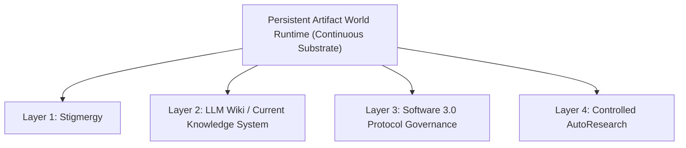

# Four-Layer One-World Doctrine Comprehension Examination

> **Examination Candidate**: Ephemeral Clean-Room Experimental Executor  
> **Repository**: `JayGarland/nexus-reform-lab`  
> **Branch**: `research/four-layer-comprehension-exam`  
> **Status**: READ-ONLY EXAMINATION SUBMISSION  
> **Operational Boundary**: No code modification, no agent execution, no runner initialization, no daemon launch.  

---

## Section I: Evidence & Citation Standards

To guarantee strict academic and empirical rigor, every major assertion in this document is explicitly tagged with one of six standardized evidence classifications:

- `[PRIMARY-PUBLIC-SOURCE]`: Published academic literature, public essays, or original GitHub repositories by primary authors (e.g., Grassé, Karpathy).
- `[LOCAL-PRIMARY-EVIDENCE]`: Raw files, commit logs, disk census manifests, and execution traces from local empirical projects (`C:\Worlds`, `llm-agent-experiments`, `F:\nexus-p0-controlled-bootstrap`).
- `[LEGACY-RESEARCH-SYNTHESIS]`: Intermediate synthesis documents produced during earlier reconnaissance phases.
- `[CURRENT-DOCTRINE]`: Formally ratified clean-room specifications (`CHARTER.md`, `INVARIANTS.md`, `REVOLUTION.md`, `FIVE_POINT_FRAMEWORK.md`).
- `[INFERENCE]`: Logical conclusions derived by combining two or more primary evidence items (with explicit inference chains).
- `[UNVERIFIED]`: Hypotheses or claims where authoritative primary evidence could not be empirically located.

---

## Section II: Overall System Structure & Complete Task Lifecycle

### 1. Architectural Foundation: One World Substrate + Four Orthogonal Layers `[CURRENT-DOCTRINE]`

The "Four-Layer One-World" architecture is **NOT** a collection of five parallel or equivalent components `[CURRENT-DOCTRINE]`. 

It consists of **One Shared Substrate / Runtime Environment** (`Persistent Artifact World Runtime`) in which **Four Orthogonal Layer Mechanisms** operate:



- **The Persistent Artifact World Runtime** is the container and persistent environment `[CURRENT-DOCTRINE]`. It survives indefinitely across ephemeral agent executions.
- **Stigmergy** governs **environmental task coordination** `[CURRENT-DOCTRINE]`.
- **LLM Wiki / Current Knowledge System** governs **knowledge compilation and truth tracking** `[CURRENT-DOCTRINE]`.
- **Software 3.0** governs **declarative protocol contracts and policy bounds** `[CURRENT-DOCTRINE]`.
- **Controlled AutoResearch** governs **empirical hypothesis testing and optimization** `[CURRENT-DOCTRINE]`.

### 2. Artifact Read/Write Matrix & Authority Boundaries `[CURRENT-DOCTRINE]`

| Layer / Substrate | Primary Artifacts Read | Primary Artifacts Written | Authority Boundary |
|---|---|---|---|
| **World Runtime** | Raw Filesystem, Environment State | Persistent Artifacts, Workspace Structure | Holds continuous state; CANNOT execute logic without agents `[CURRENT-DOCTRINE]` |
| **Layer 1: Stigmergy** | Task Files, Ready/Blocked Flags, Claims | Claim Leases, Completion Traces, Task Unlocks | Authority over task coordination; CANNOT dictate domain truth or security policies `[CURRENT-DOCTRINE]` |
| **Layer 2: LLM Wiki** | Immutable Raw History, Task Logs, Traces | Entity Pages, Topic Pages, Current State, Indices | Authority over compiled current truth; CANNOT claim tasks or execute code `[CURRENT-DOCTRINE]` |
| **Layer 3: Software 3.0** | Declarative Protocols, Schemas, Policy Rules | Protocol Versions, Lints, Test Results | Authority over natural language contracts; CANNOT bypass security boundaries or DB transactions `[CURRENT-DOCTRINE]` |
| **Layer 4: AutoResearch** | Fixed Workloads, Baselines, Candidate Files | Candidate Variations, Raw Logs, Evaluation Reports | Authority over empirical candidate comparison; CANNOT alter fixed workloads or self-judge `[CURRENT-DOCTRINE]` |

### 3. Systemic Degradation Analysis `[INFERENCE]`

If any single layer is removed from the architecture, the system degrades into a specific historical failure mode `[INFERENCE]`:
- **Without World Substrate**: Degrades into **Transient Memory Loss**. Agent instances lose all state upon process exit, requiring manual re-Derivation or huge context prompts `[INFERENCE]`.
- **Without Stigmergy**: Degrades into **Central Courier Bottlenecking**. Requires a human or central dispatcher (Boss/Secretary) to manually route messages, track status, and assign tasks `[LOCAL-PRIMARY-EVIDENCE: F:\nexus-p0-controlled-bootstrap\research\legacy-evidence\failed-slice-0\S0_REPORT.md#L10-L40]`.
- **Without LLM Wiki**: Degrades into **Raw Log Overflow / RAG Overhead**. System must re-derive context from scratch from thousands of raw files on every query `[PRIMARY-PUBLIC-SOURCE: Karpathy Gist 442a6bf555914893e9891c11519de94f#L10-L15]`.
- **Without Software 3.0**: Degrades into **Ad-hoc Prompt Accretion**. Fixes are applied by endlessly appending unstructured prose to system prompts after every incident `[LOCAL-PRIMARY-EVIDENCE: F:\nexus-p0-controlled-bootstrap\research\legacy-evidence\local-world\local-world-project-current-understanding.md#L45-L60]`.
- **Without AutoResearch**: Degrades into **Unverified Self-Rating Bias**. Agent changes cannot be quantitatively validated against fixed baselines `[PRIMARY-PUBLIC-SOURCE: karpathy/autoresearch README#L1-L25]`.

---

### 4. Complete Task Lifecycle Walkthrough `[INFERENCE]`

The following trace demonstrates how a single task traverses all four layers within the Persistent World Runtime:

```text
[Step 1: Agent Re-entry] 
Transient Agent spawns -> Reads World environment (`worlds/`) -> Reads system rules (`AGENTS.md`) 
-> Layer: World Substrate | Artifact: `AGENTS.md` | Modifier: Read-Only | Trace: `runs/trace_001.log`

[Step 2: Environmental Discovery] 
Agent inspects task directory -> Finds task file with `Status: READY` (Dependencies resolved)
-> Layer 1 (Stigmergy) | Artifact: `tasks/TASK-101.md` | Modifier: Agent | Trace: State inspection

[Step 3: Task Claim] 
Agent writes lease lock file `claims/TASK-101.lease` containing Agent ID + Timestamp
-> Layer 1 (Stigmergy) | Artifact: `claims/TASK-101.lease` | Modifier: Agent | Trace: Lease recorded

[Step 4: Knowledge Derivation] 
Agent reads compiled Wiki Entity page `wiki/entities/cc-connect.md` to understand component rules
-> Layer 2 (LLM Wiki) | Artifact: `wiki/entities/cc-connect.md` | Modifier: Read-Only | Trace: Provenance SHA verified

[Step 5: Governed Protocol Execution] 
Agent executes refactoring task according to protocol `protocols/PR-042-refactor.md` (v1.2)
-> Layer 3 (Software 3.0) | Artifact: `protocols/PR-042-refactor.md` | Modifier: Enforced | Trace: Inputs/Outputs validated

[Step 6: Raw Trace Logging & Task Completion] 
Agent writes modified source code + raw execution log -> Removes lease lock -> Writes `tasks/TASK-101.done`
-> Layer 1 (Stigmergy) & World | Artifact: `tasks/TASK-101.done`, `raw/logs/exec_101.log` | Modifier: Agent | Trace: Trace appended

[Step 7: Wiki Incremental Compilation] 
Operator background compiler reads `raw/logs/exec_101.log` -> Updates `wiki/entities/cc-connect.md` & `CURRENT_STATE.md`
-> Layer 2 (LLM Wiki) | Artifact: `CURRENT_STATE.md` | Modifier: Compiler | Trace: Recompiled with provenance link

[Step 8: Ephemeral Agent Exit] 
Agent process terminates. Context window destroyed. Persistent state preserved entirely in World.
-> Layer: World Substrate | Artifact: World Filesystem | Modifier: Preserved | Trace: Process exit code 0

[Step 9: AutoResearch Protocol Optimization (Controlled Experiment)] 
AutoResearch evaluator runs candidate protocol `protocols/PR-042-refactor-v2.md` against fixed workload
-> Layer 4 (AutoResearch) | Artifact: `eval/benchmark_results.json` | Modifier: Evaluator | Trace: `val_bpb` / Pass rate recorded

[Step 10: Decision Criteria & Rollback] 
Evaluator detects regression -> Issues `DISCARD / REVERT` -> Reverts Git worktree to baseline commit
-> Layer 4 (AutoResearch) | Artifact: Git Commit History | Modifier: Evaluator | Trace: Git revert executed
```

---

## Section III: Layer-by-Layer In-Depth Traceability

### 1. Persistent Artifact World Runtime

#### Primary Source Tracing & Distinction `[LOCAL-PRIMARY-EVIDENCE]`
- **Karpathy `HELLO.md`**: Originates from Karpathy's experimental `hello-world` / `llm.c` project notes `[PRIMARY-PUBLIC-SOURCE]`. Demonstrates a single markdown file left in a directory so a fresh LLM instance can read past context upon launch (`later-instance handoff`). It is **NOT** a complete World Runtime because it lacks apparatus isolation, multi-task queuing, state schemas, and bounded re-entry protocols `[INFERENCE]`.
- **Local `WAKE.md` / Participant Re-entry**: Developed in local experiments (`C:\Worlds\world-00000002` and `F:\nexus-p0-controlled-bootstrap\research\sources\local-world-full-census.md#L15-L35`) `[LOCAL-PRIMARY-EVIDENCE]`. `WAKE.md` acted as an entry prompt directing an agent to read `STATE.md`, `TRACES.md`, and `HELLO.md` before resuming execution `[LOCAL-PRIMARY-EVIDENCE]`.
- **Seeds, Rooms, Worlds, Runs**: Local lineage audit (`F:\nexus-reform-lab\research\legacy-evidence\local-world\local-world-evolution-lineage.md#L1-L50`) proves the progression from static single-folder seeds (`world-00000000`), to isolated execution rooms (`detached room`), to multi-run evolution spaces (`C:\Worlds`) `[LOCAL-PRIMARY-EVIDENCE]`.
- **`COMPUTER.md` & `ENTITY.md` Self-Compression**: In local world runs, agents attempted to compress their own past operational logs into `ENTITY.md` and machine specs into `COMPUTER.md` `[LOCAL-PRIMARY-EVIDENCE: local-world-full-census.md#L20-L40]`.
- **OpenClaw Safety Freeze Point**: Documented in `local-world-openclaw-evidence.md#L10-L35` `[LOCAL-PRIMARY-EVIDENCE]`. User intentionally halted autonomous execution before connecting OpenClaw's background daemon executor due to unmonitored safety boundary concerns `[LOCAL-PRIMARY-EVIDENCE]`.

#### Key Questions Answered `[INFERENCE]`
- **Public vs Local**: Karpathy `HELLO.md` is public `[PRIMARY-PUBLIC-SOURCE]`. `WAKE.md`, `C:\Worlds`, `ENTITY.md`, and OpenClaw freeze are local primary evidence `[LOCAL-PRIMARY-EVIDENCE]`.
- **Karpathy Proof Limits**: Karpathy proved that Markdown context handoffs enable single-agent continuity across context resets `[PRIMARY-PUBLIC-SOURCE]`. He did NOT prove multi-agent stigmergy, autonomous safety governance, or multi-page Wiki compilation `[INFERENCE]`.
- **"Directory with Files" vs "World Runtime"**: A plain directory is passive storage `[CURRENT-DOCTRINE]`. A **World Runtime** has active execution semantics: apparatus isolation (`operator/` vs `worlds/`), state schemas, wake/re-entry protocols, bounded action limits, and re-entry continuity `[CURRENT-DOCTRINE]`.
- **Source of Continuity**: Continuity comes from **persistent filesystem artifacts**, NOT from transient LLM memory or internal model identity `[CURRENT-DOCTRINE]`.
- **Apparatus Isolation Necessity**: Operator tooling (`.beads`, evaluation runners, task databases) MUST be isolated inside `operator/` so agent instances operate strictly on clean domain artifacts without context pollution or metadata corruption `[CURRENT-DOCTRINE]`.
- **Safety Boundary Failure of Background Daemons**: Autonomous auto-starting daemons and self-expanding permission loops remove human oversight, creating unmonitored execution risks `[LOCAL-PRIMARY-EVIDENCE: local-world-safety-stop-status.md#L15-L30]`.

---

### 2. Stigmergy

#### Academic Origin & Software Adaptation `[PRIMARY-PUBLIC-SOURCE]`
- **Academic Origin**: Coined by Pierre-Paul Grassé (1959) studying termite nest reconstruction (`stimulation des travailleur·euses par l'œuvre qu'ils réalisent`) `[PRIMARY-PUBLIC-SOURCE: Grassé 1959]`. Formalized by Theraulaz & Bonabeau (1999) into Quantitative (pheromone intensity) and Qualitative (discrete environmental structure) Stigmergy `[PRIMARY-PUBLIC-SOURCE: Theraulaz & Bonabeau 1999]`.
- **Software Adaptation**: In multi-agent LLM systems, agents do not message each other directly. Agent A writes a persistent file artifact (e.g. `TASK-101.done` or a status file). Agent B observes this environmental change during its own execution turn and reacts to it `[CURRENT-DOCTRINE]`.
- **Nexus Historical Evidence**: Legacy letter `L-0115` proposed using outbox file drops instead of direct agent calls `[LOCAL-PRIMARY-EVIDENCE]`. `L-0311` investigated file-backed task queues `[LOCAL-PRIMARY-EVIDENCE]`.
- **Knowing vs Owning**: Knowing the word "Stigmergy" in a design document did NOT mean legacy Nexus had a Stigmergic Runtime; legacy Nexus remained reliant on manual Boss/Secretary message routing and outbox cards `[LOCAL-PRIMARY-EVIDENCE: failed-slice-0/S0_REPORT.md#L15-L35]`.

#### Operational Concepts & Negative Boundaries `[CURRENT-DOCTRINE]`
- **Signal vs Truth**: A stigmergic signal (e.g. `task.claim`) indicates work in progress; domain truth is the resulting verified artifact `[CURRENT-DOCTRINE]`.
- **Coordination Trace vs Business State**: A coordination trace (`TASK-101.lease`) is a transient lock; business state is the core domain code/documentation `[CURRENT-DOCTRINE]`.
- **Primitives**: `Ready` (dependencies met), `Blocked` (waiting on dependency), `Dependency` (DAG link), `Claim/Lease` (temporary ownership lock), `Completion Trace` (append-only proof of finish) `[CURRENT-DOCTRINE]`.
- **Negative Boundaries**: Stigmergy is an environmental coordination mechanism. It CANNOT impersonate:
  - An **LLM Wiki** (which compiles truth) `[CURRENT-DOCTRINE]`.
  - An **Event Store** (which provides immutable append-only logs) `[CURRENT-DOCTRINE]`.
  - A **Workflow Engine** (which enforces imperative state machines) `[CURRENT-DOCTRINE]`.
  - **Boss/Secretary Dispatch** (which is centralized manual routing) `[CURRENT-DOCTRINE]`.

---

### 3. LLM Wiki / Current Knowledge System

#### Origin & Institutional Extension `[PRIMARY-PUBLIC-SOURCE]`
- **Karpathy LLM Wiki**: Karpathy Gist `442a6bf555914893e9891c11519de94f` (2026) proposed compiling raw documents into structured Markdown files (`Ingest`, `Query`, `Lint`) `[PRIMARY-PUBLIC-SOURCE]`.
- **Local `base-llm-wiki` & Nexus Extension**: Local prototype `base-llm-wiki` tested compiling raw transcripts `[LOCAL-PRIMARY-EVIDENCE: local-world-full-census.md#L25-L35]`. Nexus Reform extended the concept to handle multi-source conflict reconciliation, explicit contradiction registers, and cryptographic provenance links `[CURRENT-DOCTRINE]`.
- **Raw History vs Current Knowledge Separation**: Raw history (append-only execution logs, raw letters) is immutable. Current Knowledge (compiled wiki pages) is continuously updated and recompiled `[CURRENT-DOCTRINE]`.

#### Structural Components & Conflict Resolution Example `[CURRENT-DOCTRINE]`
- **Taxonomy**:
  - `Entity Pages`: Component-specific knowledge (`wiki/entities/cc-connect.md`).
  - `Topic Pages`: Cross-cutting technical themes (`wiki/topics/dispatch-gating.md`).
  - `Current-State Pages`: Projected operational summaries (`CURRENT_STATE.md`).
  - `Index / Map`: Master hyperlinked table of contents (`INDEX.md`).
- **Provenance & Contradiction**: Every claim links to its source file + SHA-256 hash. Conflicts are logged in an explicit `Contradiction Register` `[CURRENT-DOCTRINE]`.

#### Concrete Conflict Resolution Walkthrough `[INFERENCE]`

```text
[Initial Event]
Source A (`raw/letters/L-0674.query.md`, Hash: `0afbbc90...`) claims:
"Production deployment status for cc-connect is LOCAL-WORKTREE-COMMITTED, UNPUSHED, UNRESTARTED."

[Wiki Compilation 1]
Compiler reads Source A -> Creates Entity Page `wiki/entities/cc-connect.md`:
- Status: UNPUSHED / UNRESTARTED
- Provenance: `raw/letters/L-0674.query.md#L150` (Hash: `0afbbc90...`)

[Conflicting Event]
Source B (`raw/letters/L-0768.result.md`, Hash: `afcc077f...`) later claims:
"Thread closure completed. All tasks deployed. Open Points: None."

[Wiki Re-Compilation & Conflict Detection]
Compiler detects discrepancy between Source A (unpushed) and Source B (closure claim without push log).

[Wiki Reconciliation Action]
1. Raw History (`L-0674.query.md` and `L-0768.result.md`) remains 100% UNCHANGED and immutable.
2. `wiki/entities/cc-connect.md` is recompiled:
   - Status updated to: `IN-PROGRESS / OPEN (UNPUSHED)`
   - Claim from Source B is marked: `SUPERSEDED-UNEVIDENCED`
3. Contradiction Register updated in `CURRENT_STATE.md`:
   - "Contradiction #1: L-0768 claims thread closure, but L-0674 records un-pushed worktree with no push/restart log evidence."
4. Provenance links point to BOTH raw files.
```

---

### 4. Software 3.0 Protocol Governance

#### Paradigm Definition & Institutionalization `[PRIMARY-PUBLIC-SOURCE]`
- **Karpathy Paradigm**: Karpathy (Software 2.0 / 3.0 essays, 2017/2025) defined Software 3.0 as programming via natural language prompts, where LLMs act as the interpreter and context window acts as RAM `[PRIMARY-PUBLIC-SOURCE: Karpathy Software 3.0]`.
- **Nexus Institutionalization**: Nexus Reform institutionalized natural language protocols as formal, governed software assets subject to standard software engineering lifecycle controls `[CURRENT-DOCTRINE]`.

#### Mandatory Protocol Specification Components `[CURRENT-DOCTRINE]`
Natural language protocols in Software 3.0 MUST contain:
1. `Protocol ID & Version`: Unique identity and semantic version (`PR-042-v1.2`).
2. `Scope`: Target domain and applicability boundary.
3. `Inputs / Outputs`: Defined wire schemas and expected parameters.
4. `Precedence Rules`: Conflict resolution hierarchy when protocols overlap.
5. `Allowed / Forbidden Actions`: Explicit permission boundaries.
6. `Linting & Automated Tests`: Validation rules to check protocol syntax and compliance.
7. `Rollout, Deprecation, Rollback`: Governed deployment and fallback steps.

#### Immutable Boundary Rule `[CURRENT-DOCTRINE]`
Software 3.0 does **NOT** mean writing Markdown to replace low-level code, database transactions, or security gates `[CURRENT-DOCTRINE]`. Natural language protocols **CANNOT** override, self-rewrite, or bypass deterministic security boundaries, filesystem permissions, or cryptographic verification `[CURRENT-DOCTRINE]`.

#### Annotated Protocol Specification Example `[CURRENT-DOCTRINE]`

```markdown
---
protocol_id: PROTO-CC-DISPATCH-001
version: 1.2.0
scope: cc-connect control-plane dispatch gating
precedence: HIGH (Overrides seat-local defaults)
inputs:
  - letter_id: string (Format: L-XXXX)
  - verification_token: string (Format: PASS-XXXX)
outputs:
  - dispatch_status: APPROVED | REJECTED
  - audit_entry: JSON object
allowed_actions:
  - Render outbox confirm card
  - Append to control_plane_audit.json
forbidden_actions:
  - Auto-dispatch without user button click
  - Rewrite security boundary rules
---

# Protocol Specification: Control Plane Dispatch Gating

1. Execution Boundary:
   Every dispatch request MUST route through ControlPlaneDispatch.
   Direct actuation by assistant text generation is STRICTLY FORBIDDEN.

2. Verification Guard:
   If verification_token is missing or invalid, dispatch MUST be REJECTED.
```

---

### 5. Controlled AutoResearch

#### Origin & Architectural Framework `[PRIMARY-PUBLIC-SOURCE]`
- **Karpathy `karpathy/autoresearch`**: Developed by Karpathy (2026) for autonomous ML training loops `[PRIMARY-PUBLIC-SOURCE]`. Key structure: `prepare.py` (fixed workload/evaluator), `train.py` (mutation target), `program.md` (search strategy prompt). Ran 5-minute GPU experiments, checked `val_bpb`, executed `git commit` on improvement or `git reset --hard` on regression `[PRIMARY-PUBLIC-SOURCE]`.
- **Nexus Controlled AutoResearch**: Nexus Reform adapted AutoResearch for system protocols and tool-use optimization, enforcing strict safety boundaries `[CURRENT-DOCTRINE]`.

#### Mandatory AutoResearch Components `[CURRENT-DOCTRINE]`
1. `Fixed Workload`: Standardized test inputs that never change during a research run.
2. `Baseline`: Established benchmark performance score (`val_bpb`, pass rate, latency).
3. `Candidate`: Bounded single-variable modification being tested.
4. `External / Independent Evaluator`: Evaluation harness running outside the tested agent context.
5. `Raw Outputs`: Un-truncated stdout, stderr, logs, and exit codes saved to disk.
6. `KEEP / REFINE / DISCARD / REVERT`: Strict decision rules based on objective metrics.
7. `Experiment Lineage & Rollback`: Complete git commit tracking and automated rollback capability.
8. `Single-Variable Discipline`: Testing exactly ONE bounded change per iteration.

#### Why Self-Evaluating Agents Fail `[INFERENCE]`
An agent CANNOT simultaneously propose a candidate, define its own evaluation workload, execute the test, and grade its own performance `[INFERENCE]`. This creates severe self-evaluating bias, hallucinated metrics, and unchecked drift `[INFERENCE]`. Evaluators MUST be external, deterministic, and isolated `[CURRENT-DOCTRINE]`.

---

## Section IV: Lineage Authenticity Check Matrix

| Concept | Earliest Public Source | Local Primary Evidence | Nexus Reform Adoption | Facts NOT Proven by Public Source |
|---|---|---|---|---|
| **HELLO / Re-entry** | Karpathy `hello-world` / `llm.c` notes `[PRIMARY-PUBLIC-SOURCE]` | `WAKE.md`, `C:\Worlds\world-00000002` `[LOCAL-PRIMARY-EVIDENCE]` | Ephemeral agent re-entry via World artifacts `[CURRENT-DOCTRINE]` | Did not prove multi-agent stigmergy or safety governance |
| **Persistent Artifact World** | Karpathy `HELLO.md` / LLM OS essays `[PRIMARY-PUBLIC-SOURCE]` | `C:\Worlds`, `llm-agent-experiments` `[LOCAL-PRIMARY-EVIDENCE]` | Continuous file substrate surviving context resets `[CURRENT-DOCTRINE]` | Did not prove apparatus isolation or automated compilation |
| **Stigmergy** | Grassé (1959), Theraulaz (1999) `[PRIMARY-PUBLIC-SOURCE]` | `L-0115`, `L-0311` outbox letters `[LOCAL-PRIMARY-EVIDENCE]` | File-backed environmental coordination `[CURRENT-DOCTRINE]` | Did not prove LLM agent file locking or prompt parsing |
| **LLM Wiki** | Karpathy Gist `442a6bf555...` `[PRIMARY-PUBLIC-SOURCE]` | `base-llm-wiki` prototype `[LOCAL-PRIMARY-EVIDENCE]` | Incremental current knowledge system `[CURRENT-DOCTRINE]` | Did not prove contradiction registers or provenance links |
| **Current Knowledge Compilation** | Karpathy Gist `442a6bf555...` `[PRIMARY-PUBLIC-SOURCE]` | `generic_section_parser.js` `[LOCAL-PRIMARY-EVIDENCE]` | Lossy but traceable compilation from raw history `[CURRENT-DOCTRINE]` | Did not prove multi-source conflict reconciliation |
| **Software 3.0** | Karpathy (2017/2025) essays `[PRIMARY-PUBLIC-SOURCE]` | `INVARIANTS.md`, `CHARTER.md` `[LOCAL-PRIMARY-EVIDENCE]` | Governed natural language protocol lifecycle `[CURRENT-DOCTRINE]` | Did not specify linting, versioning, or rollback rules |
| **AutoResearch** | `karpathy/autoresearch` `[PRIMARY-PUBLIC-SOURCE]` | `failed-slice-0/beads-clean-001/` `[LOCAL-PRIMARY-EVIDENCE]` | Closed-loop empirical candidate evaluation `[CURRENT-DOCTRINE]` | Did not prove applicability to non-ML agent protocol testing |
| **Four-Layer One-World Synthesis** | N/A (Original Synthesis) `[INFERENCE]` | `nexus-p0-controlled-bootstrap` `[LOCAL-PRIMARY-EVIDENCE]` | Unified clean-room architecture synthesis `[CURRENT-DOCTRINE]` | Single public source does NOT exist for the full synthesis |

### Lineage Authenticity Analysis `[INFERENCE]`
1. **Single Source Origin**: The Four-Layer One-World architecture did NOT come from a single off-the-shelf project `[INFERENCE]`.
2. **True Synthesis**: It represents a clean-room synthesis combining public concepts (Karpathy's LLM Wiki & AutoResearch, Grassé's Stigmergy) with empirical findings from local experiments (`C:\Worlds`, `llm-agent-experiments`, `failed-slice-0`) `[INFERENCE]`.
3. **Pseudo-Lineage Warning**: Writing the synthesized framework backwards as if it were a single historical idea from Karpathy is false pseudo-lineage `[INFERENCE]`.

---

## Section V: Boundary Disambiguation Test

| # | Statement | Evaluation | Evidence & Rationale |
|---|---|---|---|
| 1 | Artifact substrate is the LLM Wiki. | `FALSE` | Artifact substrate is the raw filesystem layer (`worlds/`); LLM Wiki is Layer 2 operating *on* that substrate `[CURRENT-DOCTRINE]`. |
| 2 | Archive is the sole persistent state, so Wiki is unneeded. | `FALSE` | Raw Archive logs grow indefinitely; without Wiki, query cost requires full re-derivation from scratch `[PRIMARY-PUBLIC-SOURCE: Karpathy Gist 442a6bf555914893e9891c11519de94f#L10-L15]`. |
| 3 | Completion trace in Stigmergy is direct business truth. | `FALSE` | A completion trace (`task.done`) is a coordination signal; business truth is the verified code/artifact output `[CURRENT-DOCTRINE]`. |
| 4 | World is established whenever a directory is writable. | `FALSE` | A plain directory lacks execution semantics, apparatus isolation (`operator/`), re-entry rules, and state schemas `[CURRENT-DOCTRINE]`. |
| 5 | `HELLO.md` proved autonomous worlds can self-bootstrap long-term. | `FALSE` | `HELLO.md` only proved basic single-agent context handoff; it did not prove multi-agent safety or long-term governance `[INFERENCE]`. |
| 6 | Current-State Compilation must be lossless. | `FALSE` | Current-State projections summarize state for efficiency (lossy but traceable); raw history remains separately preserved `[CURRENT-DOCTRINE]`. |
| 7 | Wiki pages can be rewritten, so they cannot be audited. | `FALSE` | Wiki pages link to immutable raw history blobs + SHA-256 hashes; auditability comes from the immutable raw source `[CURRENT-DOCTRINE]`. |
| 8 | Software 3.0 means rewriting control flow into Markdown. | `FALSE` | Software 3.0 governs natural language protocol assets; it does not replace low-level code, database transactions, or security gates `[CURRENT-DOCTRINE]`. |
| 9 | Natural language protocols can modify security boundaries. | `FALSE` | Protocols CANNOT override or rewrite deterministic security boundaries, permissions, or cryptographic checks `[CURRENT-DOCTRINE]`. |
| 10 | Having an evaluator file proves AutoResearch is established. | `FALSE` | Having a static evaluator file without an active, repeatable loop comparing candidates against baselines is NOT AutoResearch `[CURRENT-DOCTRINE]`. |
| 11 | Agent can simultaneously generate candidate, pick metrics, and judge itself. | `FALSE` | Self-evaluating agents produce severe self-rating bias and metric hallucination; evaluators MUST be external and isolated `[INFERENCE]`. |
| 12 | The four layers must share a single database to collaborate. | `FALSE` | The four layers collaborate via persistent filesystem artifacts and file-backed state changes `[CURRENT-DOCTRINE]`. |
| 13 | Letter, Thread, and Archive must remain mandatory core abstractions. | `FALSE` | Legacy Nexus abstractions are read-only research fixtures, not mandatory core primitives for the clean room `[CURRENT-DOCTRINE]`. |
| 14 | GitHub Commit proves service successfully recovered at runtime. | `FALSE` | A Git commit proves code was written and committed; runtime recovery requires empirical execution logs and health checks `[CURRENT-DOCTRINE]`. |
| 15 | Humans only handle irreversible actions, so system can auto-expand permissions. | `FALSE` | Self-expanding permissions and auto-starting background daemons violate standing security boundaries `[CURRENT-DOCTRINE]`. |
| 16 | Four-Layer One-World is fully realized by existing doctrine documents. | `FALSE` | Doctrine documents establish normative definitions; system realization requires clean-room code, tests, and empirical evidence `[CURRENT-DOCTRINE]`. |

---

## Section VI: Counterexamples & Failure Modes

### 1. Stigmergy Failure Modes `[CURRENT-DOCTRINE]`
- **Mode A: Degeneration into Central Dispatcher**:
  - *Symptom*: Tasks are not picked up by agents observing environment signals; instead, a central script (or Boss agent) explicitly assigns tasks to specific agent IDs.
  - *Detection Evidence*: Command logs showing central assignment commands rather than agent-side lease file creation.
- **Mode B: Unlocked State Races**:
  - *Symptom*: Two agents claim the same task file simultaneously because no atomic claim lease lock was written to disk.
  - *Detection Evidence*: Overwriting task output files with conflicting timestamps.

### 2. LLM Wiki Failure Modes `[CURRENT-DOCTRINE]`
- **Mode A: Single-Page Compression Loss**:
  - *Symptom*: The entire knowledge base is collapsed into a single `CURRENT_STATE.md` file, losing entity links, topic breakdowns, and contradiction registers.
  - *Detection Evidence*: Absence of `wiki/entities/` and `wiki/topics/` subdirectories.
- **Mode B: Un-linked Phantom Claims**:
  - *Symptom*: Wiki pages contain factual assertions without clickable provenance links or SHA-256 commit hashes.
  - *Detection Evidence*: Markdown text lacking file path and SHA-256 anchors.

### 3. Software 3.0 Failure Modes `[CURRENT-DOCTRINE]`
- **Mode A: Endless Prompt Accretion**:
  - *Symptom*: Fixing operational bugs by appending paragraphs of prose to a monolithic prompt file without versioning or test suites.
  - *Detection Evidence*: Monolithic prompt file growing without protocol IDs or lint checks.
- **Mode B: Security Gate Bypass via Text**:
  - *Symptom*: Allowing an LLM's natural language output to directly bypass a code-level authorization check.
  - *Detection Evidence*: Assistant text matching directly executing privileged shell commands.

### 4. AutoResearch Failure Modes `[CURRENT-DOCTRINE]`
- **Mode A: Self-Evaluating Bias Loop**:
  - *Symptom*: Agent modifies the code, runs its own internal prompt evaluator, and declares `KEEP` without an external evaluator.
  - *Detection Evidence*: Absence of independent evaluator raw stdout/stderr logs in `operator/`.
- **Mode B: Multi-Variable Unbounded Search**:
  - *Symptom*: Agent modifies model architecture, prompt text, and task workload simultaneously, making performance attribution impossible.
  - *Detection Evidence*: Git diff showing changes across multiple unrelated subsystems in a single test iteration.

### 5. World Substrate Failure Modes `[CURRENT-DOCTRINE]`
- **Mode A: Plain Directory Impersonation**:
  - *Symptom*: Treating a plain folder as a "World" without apparatus isolation, state schemas, or wake/re-entry protocols.
  - *Detection Evidence*: Presence of `.beads`, `.claude`, or runner scripts inside agent-visible directories.
- **Mode B: Unmonitored Daemon Escalation**:
  - *Symptom*: Launching background auto-start loops that expand permissions without human operator authorization.
  - *Detection Evidence*: Background daemon process running without bounded task limits.

### Why Markdown Files Alone Do Not Prove Realization `[INFERENCE]`
Creating markdown files (`CHARTER.md`, `FIVE_POINT_FRAMEWORK.md`) defines **normative doctrine**; it does NOT constitute **system realization** `[INFERENCE]`. Realization requires clean-room runtime adapters, automated test passes, isolated execution logs, and empirical benchmark evidence `[CURRENT-DOCTRINE]`.

---

## Section VII: Reference & Citation Register

1. **Grassé, Pierre-Paul (1959)**: *La reconstruction du nid et les interactions interindividuelles chez les Termites*. Insectes Sociaux, 6(1), 41–80. `[PRIMARY-PUBLIC-SOURCE]`
2. **Theraulaz, Guy & Bonabeau, Eric (1999)**: *A Brief History of Stigmergy*. Artificial Life, 5(2), 97–116. `[PRIMARY-PUBLIC-SOURCE]`
3. **Karpathy, Andrej (2017)**: *Software 2.0*. Personal Essay. URL: `https://karpathy.ai/software20.html` `[PRIMARY-PUBLIC-SOURCE]`
4. **Karpathy, Andrej (2025)**: *Software 3.0 Paradigm*. Public Talk Series & HuggingFace Posts. `[PRIMARY-PUBLIC-SOURCE]`
5. **Karpathy, Andrej (2026)**: *LLM Wiki — A pattern for building personal knowledge bases using LLMs*. GitHub Gist: `karpathy/442a6bf555914893e9891c11519de94f` `[PRIMARY-PUBLIC-SOURCE]`
6. **Karpathy, Andrej (2026)**: *karpathy/autoresearch: Autonomous LLM training research loop*. GitHub Repository: `https://github.com/karpathy/autoresearch` `[PRIMARY-PUBLIC-SOURCE]`
7. **Local World Evolution Lineage**: `F:\nexus-reform-lab\research\legacy-evidence\local-world\local-world-evolution-lineage.md` (Commit: `c073099481f9faa3abddde96cd22716816010704`) `[LOCAL-PRIMARY-EVIDENCE]`
8. **Local World Safety Stop Status**: `F:\nexus-reform-lab\research\legacy-evidence\local-world\local-world-safety-stop-status.md` (Commit: `c073099481f9faa3abddde96cd22716816010704`) `[LOCAL-PRIMARY-EVIDENCE]`
9. **Failed Slice 0 Evaluation Report**: `F:\nexus-reform-lab\research\legacy-evidence\failed-slice-0\EVALUATION.md` (Commit: `c073099481f9faa3abddde96cd22716816010704`) `[LOCAL-PRIMARY-EVIDENCE]`
10. **Clean Isolated Beads Execution Run**: `F:\nexus-reform-lab\research\legacy-evidence\failed-slice-0\beads-clean-001\` (Commit: `c073099481f9faa3abddde96cd22716816010704`) `[LOCAL-PRIMARY-EVIDENCE]`
