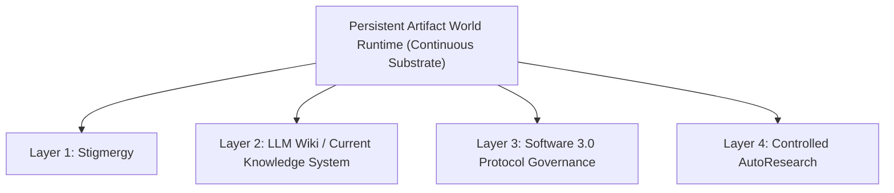

# CANONICAL DOCTRINE — ONLY AUTHORITATIVE FIVE-POINT DEFINITION

> **Document Status**: CANONICAL DOCTRINE (Repair 0.2.1)  
> **Authority**: Sole authoritative specification of the Four-Layer One-World Architecture for the Nexus Reform Lab.  

---

## 1. Structural Architecture: One World Substrate + Four Orthogonal Layers

The architecture consists of **One Persistent Artifact World Runtime** (the continuous runtime substrate) and **Four Orthogonal Layer Mechanisms** that operate within it:

---

## 2. The Persistent Artifact World Runtime (The One World)

The **Persistent Artifact World Runtime** is not a plain filesystem directory, nor is it merely a Git repository. It is a continuous, state-gated environment designed for ephemeral agent re-entry:

1. **Lifecycle Loop**: Operates on an explicit `observe → act → leave trace → exit → re-entry` lifecycle loop.
2. **Transient Agent Executor Pattern**: Ephemeral agent instances are temporary, unprivileged executors with no inherited internal state, seat identity, or persona.
3. **Inherited Structure**: Subsequent agent instances inherit accumulated structure, state, and knowledge by reading persistent world artifacts upon wake/re-entry.
4. **Apparatus Isolation**: Agent-visible world state (`worlds/`) MUST remain strictly isolated from operator tooling, evaluation harnesses, runners, and databases (`operator/`).
5. **Bounded Actions**: Agent actions within the World are strictly bounded by explicit policy rules and human-authorized execution limits.
6. **Criteria Distinguishing World Runtime from Plain Directory**:
   - A plain directory is a passive storage location.
   - A **World Runtime** enforces state schemas, apparatus isolation, wake/re-entry protocols, structural invariants, and automated projection compilation.

---

## 3. The Four Orthogonal Layers

### Layer 1: Stigmergy
- Environment-mediated coordination. Ephemeral agents discover work, claim tasks, update progress, and signal completion by leaving persistent artifacts (files, records, status flags) in the environment, rather than passing transient context messages.

### Layer 2: LLM Wiki / Current Knowledge System
- Continuous, incremental compilation of raw append-only execution history into a structured, hyperlinked knowledge system (Entity pages, Topic pages, Current State projections, Indices, Contradiction registers, and Provenance matrices).

### Layer 3: Software 3.0 Protocol Governance
- Natural language protocols are treated as versioned, governed software assets.
- **Mandatory Protocol Components**:
  - `Protocol ID` & `Version`
  - `Scope` (Target domain and applicability)
  - `Inputs / Outputs` (Defined wire formats and parameters)
  - `Precedence Rules` (Conflict resolution hierarchy)
  - `Allowed / Forbidden Actions` (Explicit permissions)
  - `Linting & Automated Tests`
  - `Rollout`, `Deprecation`, and `Rollback` procedures
- **Immutable Boundary Rule**: Software 3.0 does NOT replace deterministic code, databases, transaction boundaries, or security enforcement mechanisms. Protocols CANNOT override, bypass, or self-rewrite security boundaries.

### Layer 4: Controlled AutoResearch
- Closed-loop empirical hypothesis generation, tool-use evaluation, and quantitative/qualitative verification.
- **Mandatory Requirements**:
  - `Fixed Workload`: Standardized test inputs.
  - `Baseline`: Established benchmark performance.
  - `Candidate`: Bounded single-variable modification being tested.
  - `External / Independent Evaluator`: Evaluation executed outside the tested agent context.
  - `Raw Outputs`: Full stdout, stderr, logs, and exit codes captured and persisted.
  - `Decision Criteria`: Explicit `KEEP / REFINE / DISCARD / REVERT` rules.
  - `Experiment Lineage & Rollback`: Clear parent commit tracking and automated rollback capability.

---

## 4. Anti-Drift Clauses

1. **World != Five Parallel Components**:
   - The World is the unified substrate; Stigmergy, LLM Wiki, Software 3.0, and AutoResearch are four layer mechanisms operating inside it.
2. **Software 3.0 != Markdown Replacing Imperative Code**:
   - Software 3.0 governs natural language protocol assets; it does not replace low-level code, database transactions, or security gates.
3. **AutoResearch != A Static Human Evaluation Table**:
   - AutoResearch requires automated, repeatable empirical loops comparing candidates against baselines with external evaluators and raw output logs.
4. **Wiki != A Single `CURRENT_STATE.md` File**:
   - An LLM Wiki is a multi-page, hyperlinked knowledge graph. A single `CURRENT_STATE.md` file is merely a projected view.
5. **Current State is Lossy but Traceable**:
   - Current State projections summarize state for efficiency; Raw History is preserved separately in append-only format.

---

## Related Concept Clarification

- [`STIGMERGY_CARRIER_AND_ARTIFACT_TAXONOMY.md`](STIGMERGY_CARRIER_AND_ARTIFACT_TAXONOMY.md) — `CONCEPT CLARIFICATION — CONFIRMED FOR CONCEPTUAL SCOPE`. Not immutable permanent architecture; may evolve through a formal proposal. Clarifies Stigmergy (environment-mediated coordination concept/capability boundary), carriers, artifact types, stigmergic signals, optional extensions, and the Nexus boundary. Does not amend this framework.
