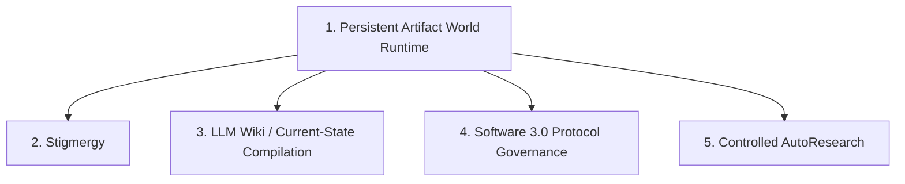

# CANONICAL DOCTRINE — ONLY AUTHORITATIVE FIVE-POINT DEFINITION

> **Document Status**: CANONICAL DOCTRINE  
> **Authority**: Sole authoritative specification of the Five-Point / Four-Layer One-World Architecture for the Nexus Reform Lab.  

---

## 1. The Five Core Architectural Components

### Component 1: Persistent Artifact World Runtime
- The continuous, file-backed environment in which ephemeral agent instances run, mutate state, and exit.
- Survives independently across agent restarts.

### Component 2: Stigmergy
- Environment-mediated coordination. Ephemeral agents coordinate by leaving persistent artifacts (files, records, status flags) in the environment, rather than passing transient context messages.

### Component 3: LLM Wiki / Current-State & Knowledge Compilation
- The continuous ingestion, extraction, reconciliation, and compilation of raw execution history into a structured, multi-page, linked knowledge graph.

### Component 4: Software 3.0 Protocol Governance
- Declarative specifications written in plain text / markdown that govern system invariants, state transitions, and execution boundaries, replacing rigid imperative code.

### Component 5: Controlled AutoResearch
- Closed-loop hypothesis generation, tool-use probes, evaluation metric logging, and empirical verification.

---

## 2. Anti-Drift Clauses & Strict Definitions

To prevent semantic degradation, the following anti-drift clauses are formally ratified:

1. **Wiki != A Single Parser**:
   - An LLM Wiki is NOT a simple script or AST parser. It is an active compilation pipeline that extracts claims, reconciles entities, and synthesizes structured knowledge.

2. **Wiki != A Single `CURRENT_STATE.md` File**:
   - An LLM Wiki is a multi-page, hyperlinked, incrementally recompiled knowledge system containing entity pages, topic pages, indices, provenance matrices, correction registers, supersede tags, and explicit contradiction logs. A single `CURRENT_STATE.md` file is merely a projected view, not the entire Wiki.

3. **Current State is Lossy but Traceable**:
   - Current-State projections summarize truth and are inherently lossy for efficiency. They are NOT required to be lossless.
   - Complete, lossless historical evidence MUST remain separately preserved in append-only Raw History artifacts. Current State and Raw History MUST NEVER be collapsed into the same file.

4. **Software 3.0 != A Single Protocol File**:
   - Software 3.0 is a comprehensive governance system of declarative contracts, policy boundaries, and validation rules, not a single static preamble or prompt snippet.

5. **AutoResearch != A Human Evaluation Table**:
   - AutoResearch is an automated, repeatable empirical loop consisting of hypothesis formulation, probe execution, quantitative benchmark logging, and automated evaluation. A static manual markdown table is not AutoResearch.

6. **World != A Plain Directory**:
   - An Artifact World is a structured, persistent, state-gated environment operating under strict apparatus isolation rules, where agent visibility is strictly bounded and operator tooling (`.beads`, CLI runners) is isolated from domain state.
