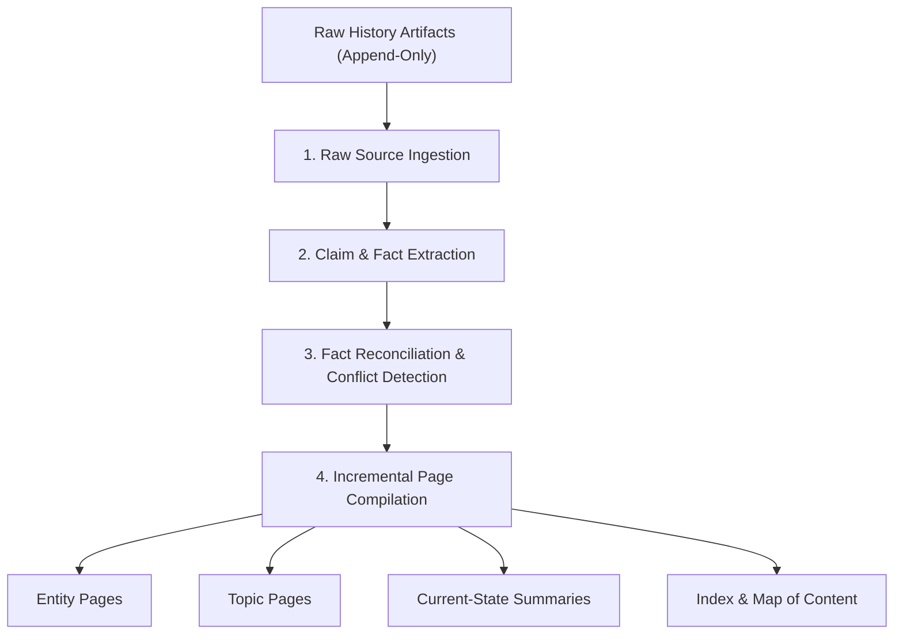

# LLM Wiki & Current Knowledge System Architecture

> **Document Status**: CANONICAL SPECIFICATION  
> **Scope**: Specification for the LLM Wiki Knowledge Compilation Subsystem in the Nexus Reform Lab  

---

## 1. System Architecture & Lifecycle

An LLM Wiki is a multi-page, hyperlinked, provenance-aware knowledge system compiled incrementally from raw execution logs, artifacts, and human directives.

---

## 2. Core Functional Requirements

1. **Raw Source Ingestion**:
   - Ingest raw, immutable history files (letters, execution logs, benchmark outputs, transcript slices).
   - Maintain strict separation: Raw History is immutable and append-only; Current Knowledge is compiled and updated.

2. **Claim Extraction & Provenance Tracking**:
   - Extract factual assertions, commitments, open points, and status changes.
   - Attach cryptographic provenance (file relative path + SHA-256 hash) to every extracted claim.

3. **Reconciliation & Contradiction Management**:
   - Reconcile new assertions with existing knowledge pages.
   - Maintain explicit **Contradiction Registers** for conflicting claims (e.g., closure claims without deployment evidence).
   - Flag unverified assertions as `UNKNOWN` or `CLAIMED-NOT-EVIDENCED`.

4. **Structured Multi-Page Taxonomy**:
   - **Entity Pages**: Dedicated pages for systems, components, and tools (e.g., `cc-connect`, `Beads`).
   - **Topic Pages**: Synthesized pages covering specific architectural themes or investigations.
   - **Current-State Pages**: High-level summary projections of current system state.
   - **Index & Map**: Master table of contents linking all wiki pages and provenance sources.

5. **Versioning, Corrections & Supersession**:
   - Mark outdated hypotheses or superseded documents explicitly with `SUPERSEDED` headers and rationale.
   - Apply correction notes directly to affected pages while preserving historical links.

6. **Incremental Affected-Page Rebuild**:
   - Recompile ONLY pages affected by new raw events, avoiding full-vault re-synthesis cost.
