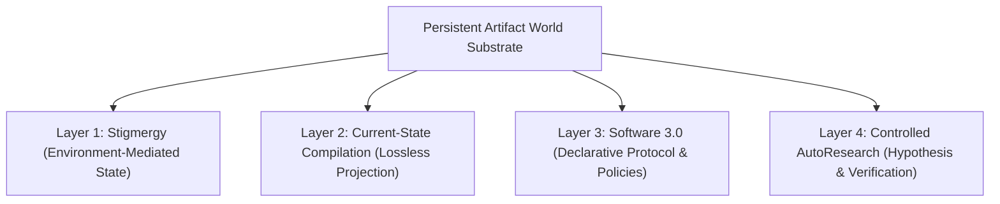

# Four-Layer One-World Framework ("四层一世界")

> **Official Abbreviation**: 四层一世界 (Four Layers, One World)  
> **Clean-Room Status**: RATIFIED  

---

## 1. Executive Summary

The Four-Layer One-World framework decouples system persistence, agent coordination, protocol compilation, and empirical evaluation. Agent instances are transient executors; the Artifact World runtime is the continuous persistent substrate.

---

## 2. The Four Orthogonal Layers

1. **Stigmergy**: Coordination achieved strictly through environmental modification (file creation/editing) rather than inter-agent messaging channels.
2. **Current-State Compilation**: Deterministic compilation of system history and state into a single, loss-free current-state representation (`CURRENT_STATE.md`).
3. **Software 3.0 Protocol Governance**: Declarative markdown rules and contracts governing system transitions rather than imperative control flows.
4. **Controlled AutoResearch**: Systematic hypothesis generation, empirical execution, and quantitative/qualitative evaluation loops.

---

## 3. Persistent Artifact World Runtime

- **Runtime Substrate**: The filesystem and markdown artifacts constitute the "World".
- **Transient Agents**: Agent instances spawn, execute, mutate artifacts, and terminate. No identity or internal state is preserved across agent boundaries.
- **Apparatus Isolation**: Tooling (Beads, CLI runners, evaluation scripts) must remain in `operator/` and never leak into `worlds/`.
